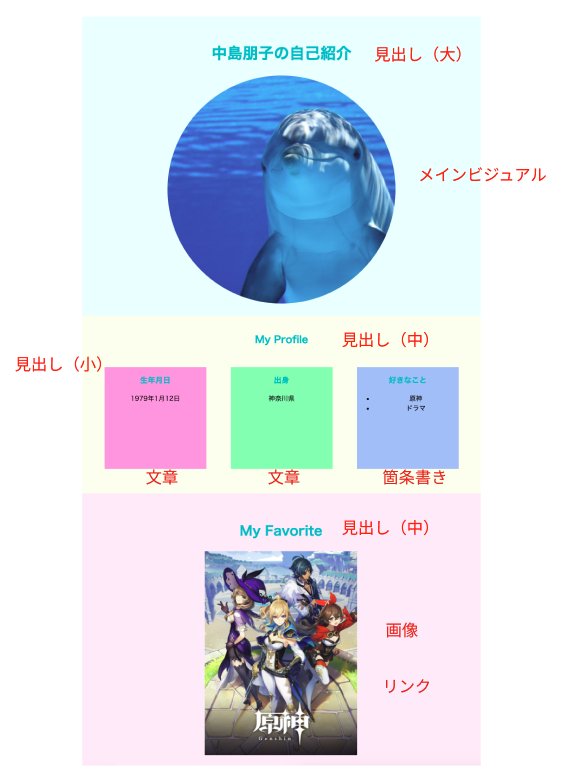

# **1日目**

## **Webサイトを作ろう**

５回のレッスンで自己紹介サイトを作ります    

最後は自由にアレンジしてオリジナルのサイトを作ろう
<br><br>

### **①HTML・CSSとは**


<br><br>

### **②環境構築**  

Webサイトを制作に必要なアプリのインストールを行います

<br>

### **③VSCode（Visual Studio Code）**  

https://code.visualstudio.com/download

<br><br>

### **④VSCodeの使い方**  

HTMLを書いてみよう

<br>

```html
<!doctype html>
<html>
    <head>
        <meta charset="UTF-8">
        <title>自己紹介</title>
    </head>
    <body>
        <h1>[自分のなまえ]の自己紹介</h1>
    </body>
</html>
```
### **ポイント**

- `<>`で囲まれたもの　→ `タグ`
- `<html>`　`</html>`　→　`<開始タグ>`　`<終了タグ>`がセット
- インデント　→ タグの左側の余白

<br><br>

### **⑤webサイトの構成を考えよう** 

Webサイトの情報を整理してみよう



<br>

- 見出し
- メインビジュアル
- 文章
- リスト
- 画像
- リンク

<br><br>

### **⑥グループを考えよう** 


```html
<!doctype html>
<html>
    <head>
        <meta charset="UTF-8">
        <title>自己紹介</title>
    </head>
    <body>
        <div class="header">
            
        </div>
        <div class="profile">
            <div class="box1">
                <div class="section1">
    
                </div>
                <div class="section2">
                    
                </div>
                <div class="section3">
                    
                </div>
            </div>
        </div>
        <div class="favorite">
            <div class="box2">
                
            </div>
        </div>        
    </body>
</html>
```
<br>

### **グループを作るタグ`<div>`**  

<br>

グループに名前をつけて、何のグループかわかるようにしておきます  
この後で習うCSSでデザインするときに必要です  

- `class=""` `ダブルコーテーション`の中に名前を入れる
- 半角英数字
- そのグループの内容がわかるようにつける